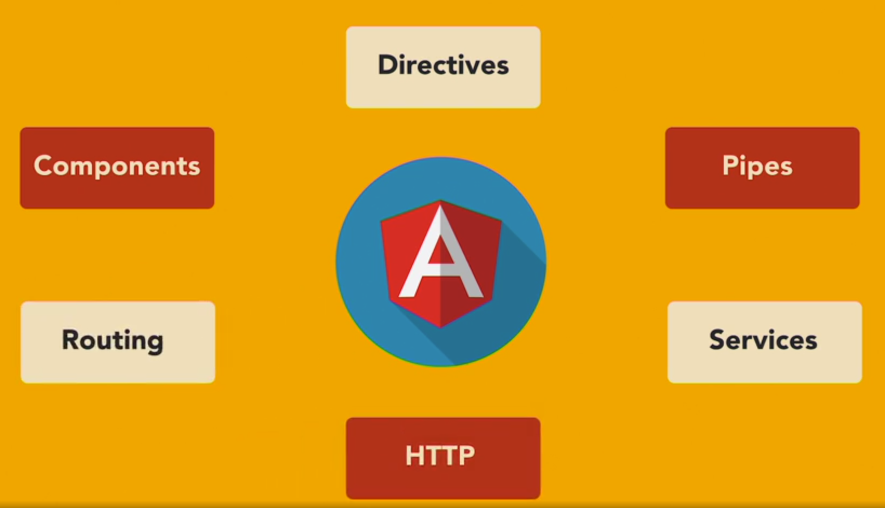
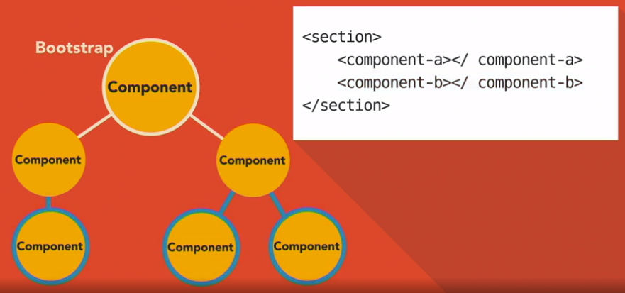
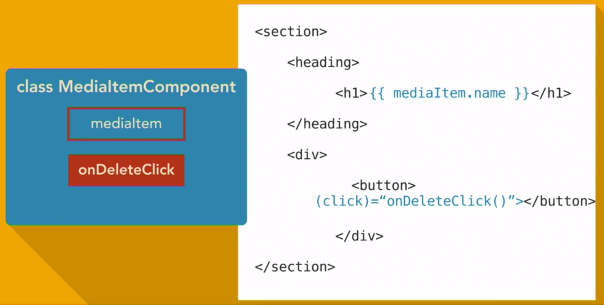
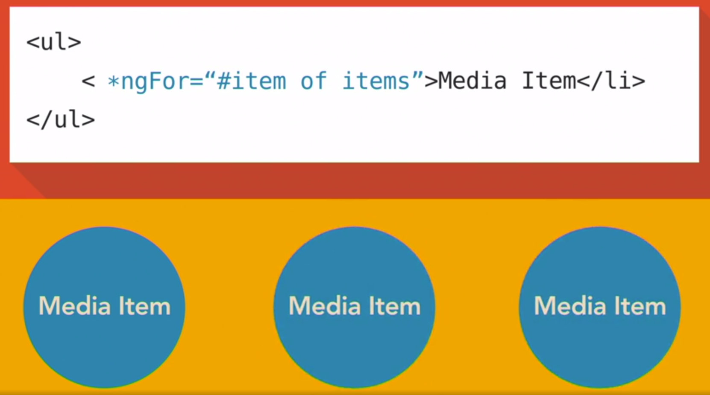
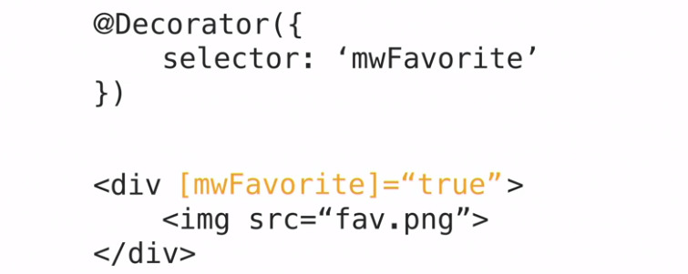
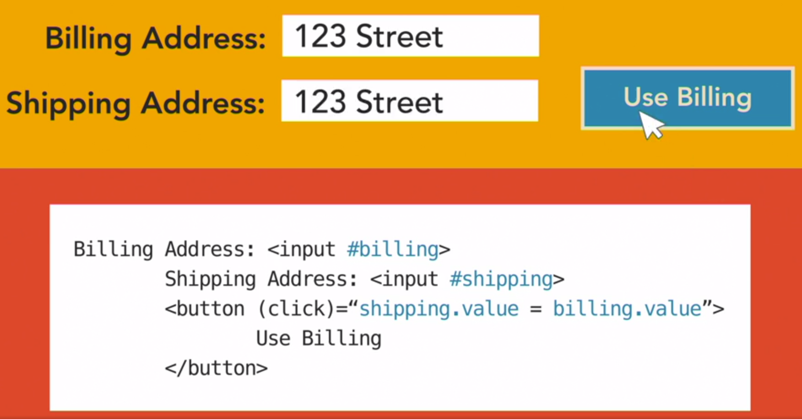
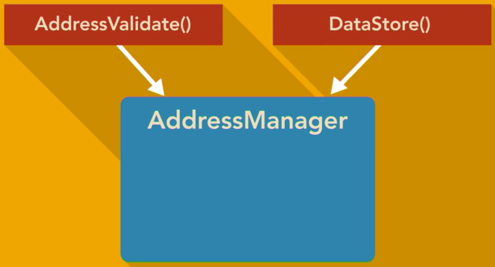
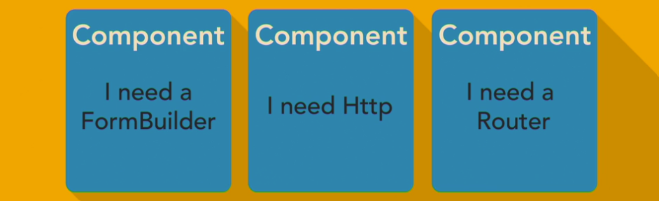

 
# ANGULAR
*Building a media watch list application* 
- Parts that you use to write applications in Angular:
  
## Components, Bootstrap, and the DOM
### Intro to Component
- Angular is built upon ***components***. 
- The starting point of an Angular app is the bootstrapping(like the HTML DOM tree) - Angular runs on a component tree model. 
- After Angular loads the first component with the bootstrap call, it then looks within that component's HTML view and sees if it has any nested components. 
- If so, Angular finds matches and runs the appropriate component code on those. This repeats for each component down the tree. 
  
- *A component in Angular is used to render a portion of HTML and provide functionality to that portion*.  
-  It does this through a ***Component class*** in which you can define application logic for the component. 
- For example, you can have a MediaItemComponent that can have a property named mediaItem that represents the data for a mediaItem.   
  And that component can also have a method called onDeleteClick that can handle raising the delete mediaItem event.  
  With each component in Angular, you can ***specify an HTML template***, the markup that will get rendered. And through the use of the Component class and how Angular renders the component, you can display the data for the mediaItem property in your template.  
  And Angular provides an easy syntax, known as the ***template syntax***, to wire up to DOM events within your template. So you can wire up the click event on a button to the onDeleteClick method.  
  

- You can even use ***components within components***. This is where the component tree comes into play. You can build out your Angular apps by having components rendering components within their templates.  
- Each component gets configured with a ***selector***, which tells Angular what markup element tag to associate the Component class logic with. *When you build a component in Angular, you are creating support for a new custom element for the DOM*.
<br/>

### NgModule and the Root Module  
- Angular leverages ***decorators*** to help configure code like classes, methods, and fields. 
- TypeScript provides support for decorators through its transpiler. The syntax for using a decorator is the At symbol, followed by the decorator name, and then a pair of parentheses. ```@Component()```
NgModule and the root module
- [Instructor] 
- An Angular application starts with an ***Angular module***, which gets configured using a decorator. An Angular modules help to keep application code organized by blocks of functionality and features.
- A ***root module*** acts as the starting point module for an Angular application.

^ Creating the root module class in a file named app.module.ts, that is in the Source/App folder of the project.   
^ We need to use a decorator to annotate that class so Angular will know it's an Angular module. To inform Angular that the class code in here is intended to be an Angular module, you need to decorate it with the NgModule decorator. Angular exports the NgModule decorator from its core scoped package. To use the decorator from the package, you need to import it using the module loading syntax that TypeScript supports. You start with the keyword import, followed by a space and a pair of curly braces. Inside the curly braces, you list the types that you want to import. We want to import the NgModule decorator, so I will put that inside the curly braces. You can import more than one type from a module by adding a comma after each. We don't need to do that right now, but I will cover that in a later lesson. After the curly braces, you put a space and then the from keyword, followed by another space. After that, you need to put the module name in the form of a string. The module loading syntax supports loading from a bare module name or a relative path to a file. Angular provides a handful of modules in its platform that it exposes via scoped packages. The NgModule decorator comes from the core scoped package in Angular. So for the string of the module name, you put the module name for the Angular core module in single quotes. And you end the import statement with a semicolon. Now that we have imported the NgModule decorator, we can make use of it. When you use it in code, you prefix it with the At symbol, then NgModule and a pair of parentheses. You don't put a semicolon after this expression because it is not a statement, but rather a piece of code that will be applied to the class or in some cases the field or method that it comes before. So from here you follow it up with a class definition for the angular module. Since this is going to be our app root module, let's name it AppModule. So we type class, space, AppModule, and follow that up with a pair of curly braces. Since we are building this module in its own file, and will want to import into another file, we need to provide support for using the module loading syntax. You do this by using the export keyword in front of the class keyword. The NgModule decorator takes in an object with some known properties to configure the class you decorate as an Angular module. These properties are known as metadata. I'm going to set up an object literal with some properties here, and then I will discuss what each are used for. So for the Angular root module, I am making use of the imports, declarations, and bootstrap metadata properties. All of these can be set up as an array. The imports property is used to bring in other Angular modules that your module will need. The declarations property is used to make components, directives, and pipes available to your module that don't come from another module. The bootstrap property is used for a root module and will let Angular know which component or components will be the starting point for the bootstrap process. Basically, the entry point for your app code. Let's fill these out with some types. Since we are building a browser-based app, we want to make use of the browser module that the Angular platform has available. The browser module contains core directives, pipes, and more for working with the DOM, and can be found in the platform browser scoped package. So we need an import statement for that. And then we can add the browser module to the array for the imports metadata property. Our app is going to need a starting component. I will cover creating that in the next video, but for now let's add some code here for it. The component is going to be named AppComponent, and it is going to come from a file named app.component.ts. This file will be located right next to the app.module.ts file. So we can write the import statement for that app component and instead of loading from a bare module name, we can use a string that represents the path to the file relative to this file. That will be a dot slash, followed by the name of the file without the extension. The extension is not needed due to the way the project is configured for the TypeScript transpiling and module loading. Now that's outside of the scope of this course, so I won't dive into that in detail. But, from here we want to add the app component to the declarations property, as it is a component that we want to make available to the Angular module. Finally, we need to add the app component to the bootstrap property as well. Since this app module is being used as the root module, Angular will use the app component as a target for bootstrapping the app.


### Directives and Pipes
#### Component
Components are actually directives with a template. *Directives provide functionality and can transform the DOM.*
- Structural Directives - modify layout by altering elements in the DOM. 
- Attribute directives - change the behavior or appearance of an existing DOM element.  
You can applying directives to an existing element, or a template element, to change that element in some way.  
  
Like a component, a directive gets configured with a selector that Angular will use to find a match and apply the directive.  
You apply a directive in different ways. You can write an attribute on an element that matches your selector,  
or you can use the template syntax to add a directive and an assignment statement.  
   
In addition to creating your own directives Angular comes with a number of directives out of the box to handle common web app constructs by conditionally rendering elements based on some expression1(```ngIf```), looping out items to render(```ngFor```), or even for things like router links (```routerLink```).  
#### Pipe
Another tool in the Angular toolbox to display content is the pipe. A ***pipe*** takes in data, like a string or an array, and runs some logic to transform it to a new output.  
Angular comes with some common pipes like date, and uppercase and lowercase.  
You can also write your own pipes.  
*Pipes are a great way to change data in a reusable way without having to imbed the transformed logic within component classes. And without having to modify the data just for display purposes*.  
### Data Binding
- You can bind data to views and work with data in those views via ***interpolation***, - ```<h1>{{ movie.title}}</h1>```.  
- You can also use directives to help display data. Use the ***template syntax*** in Angular to work with data in views.  
You can wire up click events to DOM elements that modify data that you've displayed elsewhere and Angular will handle the update of that data visually.  

There are many elements to the template syntax. 
- interpolation and built-in directives
- constructs and patterns
  - Template expressions and statements
  - Value binding - binding syntax for property, attribute, class, and style bindings
  - Event binding
  - Template expression operators.  

You can also create and use local template variables created in markup using the hash to get a reference to the element and then use that from any sibling or child element in the view.  

This allows you to wire up simple interactions or display related data from within your markup without needing to write any script code.  
  
- Now when it comes to collecting data from the user, Angular has a form module loaded with directives and services for helping you build HTML forms.  
  It provides:
  - data binding for both setting and getting data
  - change tracking
  - validation
  - error handling  

### Dependency injection
- Angular brings dependency injection to JavaScript.  
- ***Dependency injection (DI)*** is the concept of *inversion of control (IoC)*, where you architect code in a way that you provide modules with other modules it needs to get some work done.
- DI allows you to write decoupled code that is easier to unit test and to work with. 
  
- You can write modular components, and services and tell Angular what/where you want to use them. 
  
- The most common place you use DI is in your class constructors.  
  - components
  - directives
  - pipes
  - services
- You can declare types on your constructor parameters with TypeScript.
- You can also leverage DI through 
  - component metadata,
  - properties, for directives and providers. 
- You can even do some DI at the bootstrap phase of an Angular app, setting up your dependency graph when your app starts up, and getting that delivered through all aspects of your app. 
- You can replace a dependency at any phase of application code.  

### Services and other Business Logic
- *Services in Angular are more of an implied pattern*. A JavaScript class or function that is encapsulated is refered to as a service in Angular. 
- Put application business logic in services.  
***Example:***  
You can write a JavaScript class that handles finding the record data and returning it as an object. This would be a service. And then, using Angular's DI framework, you can specify that a component is going to use this service. And from within the component logic, you can request the a data record from your service and make it available to your view template.  
- These services that you write can also leverage DI, so you can create constructors and specify parameter types, with the help of some TypeScript, and Angular will provide your service instance with the appropriate dependencies.  

### Data Persistence
Persist data from JavaScript in the client is handled in a couple of different ways with Angular
1. In-Memory Data Store - storing data for the time in which the user is using your application, you could store that data in memory. 
   Create a JavaScript class or object to store your data, provide it to your app as something that can be injected in, and then do constructor injection where needed to bring in the instance of that object. 
2. Local Storage Service - Write your own JavaScript code to do so and then use it with the services pattern, leveraging Angular's dependency injection to work with it throughout your application. 
3. Data Store Service - One way you can persist data to and from an API is by leveraging the HTTP protocol. You can do this in two ways. One, by using the XML HTTP request, or XHR, and the other by using JSONP. Angular provides an HTTP module in the framework for abstracting out working with the way XHR and JSONP calls are done via client script.  

### Routing
Angular provides a router module that handles routing on the client and adjusts the UI and data displayed accordingly.
This Router Module supports:  
- Route configuration to components, route params to have variables in the URL; 
- Routing links - a directive for working with links that do routing;
- Router outlets - a dircetive for specifying where in a template the routed component will display, creating child routes;
- Routing events - rougting lifecycle hooks for responding routing events;
- It also handles history state, altering the way a browser handles it by default, so that back and forward actions by the user will result in Angular route changes.

