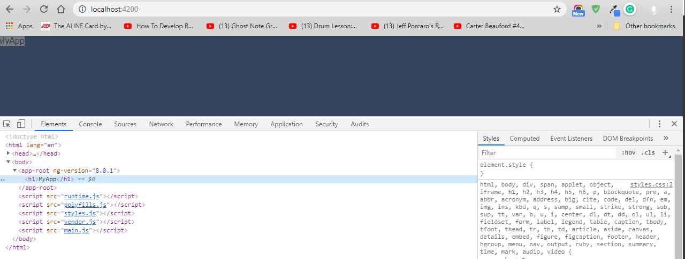

# ANGULAR

_Building a media watch list application_

- Parts that you use to write applications in Angular:
  

## COMPONENTS

- Angular is built upon **_components_**.
- The starting point of an Angular app is the bootstrapping(like the HTML DOM tree) - Angular runs on a component tree model.
- After Angular loads the first component with the bootstrap call, it then looks within that component's HTML view and sees if it has any nested components.
- If so, Angular finds matches and runs the appropriate component code on those. This repeats for each component down the tree.
  
- _A component in Angular is used to render a portion of HTML and provide functionality to that portion_.
- It does this through a **_Component class_** in which you can define application logic for the component.
- For example, you can have a MediaItemComponent that can have a property named mediaItem that represents the data for a mediaItem.  
   And that component can also have a method called onDeleteClick that can handle raising the delete mediaItem event.  
   With each component in Angular, you can **_specify an HTML template_**, the markup that will get rendered. And through the use of the Component class and how Angular renders the component, you can display the data for the mediaItem property in your template.  
   And Angular provides an easy syntax, known as the **_template syntax_**, to wire up to DOM events within your template. So you can wire up the click event on a button to the onDeleteClick method.  
  

- You can even use **_components within components_**. This is where the component tree comes into play. You can build out your Angular apps by having components rendering components within their templates.
- Each component gets configured with a **_selector_**, which tells Angular what markup element tag to associate the Component class logic with. _When you build a component in Angular, you are creating support for a new custom element for the DOM_.
  <br/>

### NgModule and the Root Module

- Angular leverages **_decorators_** to help configure code like classes, methods, and fields.
- TypeScript provides support for decorators through its transpiler. The syntax for using a decorator is the At symbol, followed by the decorator name, and then a pair of parentheses. `@Component()`
  NgModule and the root module
- An Angular application starts with an **_Angular module_**, which gets configured using a decorator. An Angular modules help to keep application code organized by blocks of functionality and features.
- A **_root module_** acts as the starting point module for an Angular application.  
  Create the root module class in a file named app.module.ts, that is in the Source/App folder of the project.  
  Use a decorator to annotate that class so Angular will know it's an Angular module - **_`NgModule` decorator_**; import it using the module loading syntax that TypeScript supports. The NgModule decorator comes from the core scoped package in Angular.

```JavaScript
import { NgModule } from '@angular/core';
```

Now we can make use of the NgModule decorator; prefix it with the At symbol, then NgModule and a pair of parentheses.  
The NgModule decorator takes in an object with some known properties to configure the class you decorate as an Angular module. These properties are known as _metadata_. All of these can be set up as an array.

- The **_imports_** property is used to bring in other Angular modules that your module will need.
- The **_declarations_** property is used to make components, directives, and pipes available to your module that don't come from another module.
- The **_bootstrap_** property is used for a root module and will let Angular know which component or components will be the starting point for the bootstrap process. Basically, the entry point for your app code.

```JavaScript
@NgModule({
  imports: [],
  declarations: [],
  bootstrap: []
})
export class AppModule {}
```

- Use of the **_browser module_** that the Angular platform has available. The browser module contains core directives, pipes, and more for working with the DOM, and can be found in the platform browser scoped package. Import the browser module and add the browser module to the array for the imports metadata property.

```JavaScript
import { BrowserModule } from "@angular/platform-browser";
```

- Our app is going to need a starting component - AppComponent (will be created later - this file will be located right next to the app.module.ts file. Import this component and add the app component to the declarations property, as it is a component that we want to make available to the Angular module.

```JavaScript
import { AppComponent } from "./app.component";
```

- Finally, we need to add the app component to the bootstrap property as well. Since this app module is being used as the root module, Angular will use the app component as a target for bootstrapping the app.

```JavaScript
@NgModule({
  imports: [BrowserModule],
  declarations: [AppComponent],
  bootstrap: [AppComponent]
})
```

<br/>

### Component metadata

- Building the first component, the app component. app -> app.component.ts
- To build an angular component:
  - use the **_component decorator_** which comes from the core scope package in angular;
  - import the component and call the decorator, using the app component syntax with the parentheses.
  - export a class for the component.  
- The component decorator takes in a ***metadata object*** with some known properties to configure the class you decorate as an angular component.
- To decorate a component, you need to provide two metadata properties at a minimum.
  - **Selector** - is what angular will use to locate a custom html element and apply the component to.
  - **Template** or **template url** - Angular will use the template property content to fill the inner html of the targeted custom element when it processes it.

```JavaScript
import { Component } from "@angular/core";

@Component({
  selector: "app-root",
  template: "<h1>MyApp</h1>"
})
export class AppComponent {}
```  
<br/>

### Bootstrapping the module for the browser
- After creating a root module and a starting component, Bootstrap the module.
- Put the bootstrap logic in a separate file - Main.ts in the app folder.
Angular has support for running on multiple platforms. For this app we are targeting the browser so we need to bootstrap for that platform. 
- Angular exports a function named ***Platform Browser Dynamic*** that can be used for targeting the browser and that comes from the platform-Browser-Dynamic scope package. So we can import the platform-Browser-Dynamic function from there.
```JavaScript
import { platformBrowserDynamic } from '@angular/platform-browser-dynamic';
```  
- This function returns a platform object that has a bootstrap module function on it. That is the function you will use to bootstrap your root module on the platform.  
This function is expecting a root module and we have one already created from earlier named App Module import it and pass the app module type into the bootstrap module function call.
 ```JavaScript
import { AppModule } from './app/app.module';

platformBrowserDynamic().bootstrapModule(AppModule);
 ```  
- And with that we have all the initial starting bits written to get this Angular app up and running in the browser. 

<br/>  

###  The Component Selector  
***Recap:***  
- Angular kicks off with the bootstrap call in the main.ts file, that takes in an Angular root module ```platformBrowserDynamic().bootstrapModule(AppModule);```.  
***main.ts file*** -
```JavaScript
import { platformBrowserDynamic } from "@angular/platform-browser-dynamic";
import { AppModule } from "./app/app.module";

platformBrowserDynamic().bootstrapModule(AppModule);
```  
- And in the app.module.ts file, that contains a list of components ```bootstrap: [AppComponent]```to use as the starting component.  
***app.module.ts file*** -
```JavaScript
import { NgModule } from "@angular/core";
import { BrowserModule } from "@angular/platform-browser";
import { AppComponent } from "./app.component";

@NgModule({
  imports: [BrowserModule],
  declarations: [AppComponent],
  bootstrap: [AppComponent]
})
export class AppModule {}
```
- In the components file (app.components.ts), Angular will use the selector property ```selector: "app-root",``` from the component metadata to find a match in the DOM (index.html), based on an element name ```<app-root></app-root>```.  
***app.component.ts*** -
```JavaScript
import { Component } from "@angular/core";

@Component({
  selector: "app-root",
  template: "<h1>MyApp</h1>"
})
export class AppComponent {}
```  
- Angular will bootstrap the AppComponent to that element.
The W3C spec states that custom DOM elements should use at least one dash in their names.  
<br/>

### The Component Template
- When Angular finds a match in the DOM for a component selector, it will render the component markup into that DOM that it found the match on.
- There are two options for this; 
  - Template - we can use back ticks around the inline template value and use multiple lines for better readability;  
  ```JavaScript
  @Component({
    selector: "app-root",
    template: `
      <h1>MyApp</h1>
      <p>Keeping track of the media I want to watch.</p>
    `
  })
  ```  
  - Template URL - specify a file that contains the template content. And one thing to note here is that the relative path can be used here because the bill process set up by the Angular CLI will handle resolving that path for us.  
  ```JavaScript
  @Component({
    selector: "app-root",
    templateUrl: "./app.component.html"
  })
  ```  
<br/>

### Styling a Component
- Angular provides support for styling a component via the component metadata in two ways, both take an array of string values;
  - Styles property - add the styles property to the object literal we are passing into our component decorator;  
  ```JavaScript
  @Component({
    selector: "app-root",
    templateUrl: "./app.component.html",
    styles: [
    `
      h1 {
        color: #ffffff;
      }
    `,
    `
      .description {
        font-style: italic;
        color: green;
      }
    `
    ]
  })
  ```  
  - StyleUrls property - , point to a file that contains the style contentNow
  ```JavaScript
  @Component({
    selector: "app-root",
    templateUrl: "./app.component.html",
    styleUrls: ["./app.component.css"]
  })
  ```  
*Note:*  
Feature that Angular does with the styles: Angular is actually shimming the style content and converting it into new selectors, then injecting it into the dom in the head tag. If we look at the source of the web app in the browser, we can see that we have a style tag in our head element, and if we look at the contents of that tag, we can find the style rules shimmed a bit. When Angular renders our components, it adds these dynamic ID attributes to the component tags and all of its children, and then uses those dynamic IDs to write new CSS rules that scope the CSS to the component element, putting these in style tags in the head tab for each component render.  
<br/> 

### Using Other Components in a Component
- While an Angular app could be made up of only a single component if the app was small, most likely it will be a composition of mini components. 
- Components is really a directives with a view, and the Angular platform is full of built-in directives that it makes available to your app. 
- Make your components available to your app.
1. We have a new component - media-item.component.ts - this will be used to display the details of a media item. We will be using it from within the app.component.ts  
***app.component.ts -***  
```JavaScript  
import { Component } from '@angular/core';

@Component({
  selector: 'mw-app',
  templateUrl: './app.component.html',
  styleUrls: ['./app.component.css']
})
export class AppComponent {}
```  
***media-item-component.ts -***  
```JavaScript
import { Component } from '@angular/core';    -> import and component decorator

@Component({
  selector: 'mw-media-item',                  -> component metadata object literal
  templateUrl: './media-item.component.html', -> content to display media item
  styleUrls: ['./media-item.component.css']
})
export class MediaItemComponent {}            -> component class
```  
- Content that displays the media item  
***media-item-component.html -***  
```JavaScript
<h2>The Redemption</h2>
<div>Watched on 1/13/2016</div>
<div>Action</div>
<div>2016</div>
<div class="tools">
  <svg class="favorite" xmlns="http://www.w3.org/2000/svg" viewBox="0 0 24 24">
    <path d="M12 9.229c.234-1.12 1.547-6.229 5.382-6.229 2.22 0 4.618 1.551 4.618 5.003 0 3.907-3.627 8.47-10 12.629-6.373-4.159-10-8.722-10-12.629 0-3.484 2.369-5.005 4.577-5.005 3.923 0 5.145 5.126 5.423 6.231zm-12-1.226c0 4.068 3.06 9.481 12 14.997 8.94-5.516 12-10.929 12-14.997 0-7.962-9.648-9.028-12-3.737-2.338-5.262-12-4.27-12 3.737z"
    />
  </svg>
  <a class="delete">
    remove
  </a>
  <a class="details">
    watch
  </a>
</div>
```
2.  Add this component to the app module, so it knows it is for use for other templates - add it to the declaration metadata property; first add the import statement.  
```JavaScript
import { NgModule } from "@angular/core";
import { BrowserModule } from "@angular/platform-browser";
import { AppComponent } from "./app.component";
import { MediaItemComponent } from "./media-item.component";

@NgModule({
  imports: [BrowserModule],
  declarations: [AppComponent, MediaItemComponent],
  bootstrap: [AppComponent]
})
export class AppModule {}
```  
3. Switch over to the app.component.html and add an DOM element ```<mw-media-item>```  
***app.component.html***  
```HTML
<section>
  <header>
    <h1>Media Watch List</h1>
    <p class="description">Keeping track of the media I want to watch.</p>
  </header>
  <mw-media-item></mw-media-item>
</section>
```  
<br/> 

### Interpolation and the expression context
Different ways Angular allows us to mark up our template.
Angular Template Syntax is made of
- Interpolation
- Binding, 
- Expressions,
- Conditional templating,
- Template variables,
- Template expression operators
<br/>

***Interpolation*** is a way to get data displayed in the view. 
 You do interpolation by using a pair of curly braces in the markup.  
 *Example:*  
 ```JavaScript
 <h2>The Redemption {{ 5+ 10 }}</h2>   => The Redemption 15 (in browser)
 ```
But not all expressions are supported. 
- Assignments, 
- Newing up variables, 
- Expressions that are chained, 
- Incrementors and decrementors are not valid expressions.


 The most common use of interpolation is to display some data from a property that we have set in the component class.  
 *Example:*  
 Switch over to the media-item-component.ts file, and add a class property named name, and assign it a string value of the redemption.  
```JavaScript
import { Component } from "@angular/core";

@Component({
  selector: "mw-media-item",
  templateUrl: "./media-item.component.html",
  styleUrls: ["./media-item.component.css"]
})
export class MediaItemComponent {
  name = "The Redemption";
}
```  
Flip back over to the template file media-item.component.html. And put name in our curly braces in place of the test expression.  
```JavaScript
<h2>{{ name }}</h2>
```  
Notice that we use the property name directly in the interpolation statement without any this dot reference, or some other component instance reference. 
This component property is made available via what is know as the ***expression context***. Methods on the component class are also available in the expression context.  
<br/>

### Property Binding
Another way you can bind data in templates with Angular is through property binding. 
HTML elements have backing dom properties that track state on elements. You can use Angular's property binding syntax to wire into those properties.  
```JavaScript
<h2 [textContent]="name"></h2>
```  
Using the property binding syntax of the square brackets, tells Angular that you want it to evaluate an expression for that property.  
 
If we leave off the brackets and put the interpolation curly braces around the property name, then back in the browser we can see that Angular will process it.  
```JavaScript
<h2 textContent="{{ name }}"></h2>
```  
So we can do property binding either way.  
<br/>

### Event Binding
- The EventBinding template syntax in Angular allows you to wire up event handlers from within your component templates. 
- You can wire up native dom element events, as well as custom events you create for your components to emit. 
- On the a tag element for the delete, we can add the event named click, wrapped with parentheses, and set it equal to a statement in quotes that will be evaluated. 
```JavaScript
  <a (click)="onDelete()" class="delete">remove</a>
```
- Switch to the media-item.component.ts file, and add an onDelete method. 
```JavaScript
export class MediaItemComponent {
  onDelete() {
    console.log('deleted');
  }
}
```
 
 

## DIRECTIVES and PIPES

#### Component

Components are actually directives with a template. _Directives provide functionality and can transform the DOM._

- Structural Directives - modify layout by altering elements in the DOM.
- Attribute directives - change the behavior or appearance of an existing DOM element.  
  You can applying directives to an existing element, or a template element, to change that element in some way.  
    
  Like a component, a directive gets configured with a selector that Angular will use to find a match and apply the directive.  
  You apply a directive in different ways. You can write an attribute on an element that matches your selector,  
  or you can use the template syntax to add a directive and an assignment statement.  
    
  In addition to creating your own directives Angular comes with a number of directives out of the box to handle common web app constructs by conditionally rendering elements based on some expression1(`ngIf`), looping out items to render(`ngFor`), or even for things like router links (`routerLink`).

#### Pipe

Another tool in the Angular toolbox to display content is the pipe. A **_pipe_** takes in data, like a string or an array, and runs some logic to transform it to a new output.  
Angular comes with some common pipes like date, and uppercase and lowercase.  
You can also write your own pipes.  
_Pipes are a great way to change data in a reusable way without having to imbed the transformed logic within component classes. And without having to modify the data just for display purposes_.

### Data Binding

- You can bind data to views and work with data in those views via **_interpolation_**, - `<h1>{{ movie.title}}</h1>`.
- You can also use directives to help display data. Use the **_template syntax_** in Angular to work with data in views.  
  You can wire up click events to DOM elements that modify data that you've displayed elsewhere and Angular will handle the update of that data visually.

There are many elements to the template syntax.

- interpolation and built-in directives
- constructs and patterns
  - Template expressions and statements
  - Value binding - binding syntax for property, attribute, class, and style bindings
  - Event binding
  - Template expression operators.

You can also create and use local template variables created in markup using the hash to get a reference to the element and then use that from any sibling or child element in the view.

This allows you to wire up simple interactions or display related data from within your markup without needing to write any script code.  


- Now when it comes to collecting data from the user, Angular has a form module loaded with directives and services for helping you build HTML forms.  
  It provides:
  - data binding for both setting and getting data
  - change tracking
  - validation
  - error handling

### Dependency injection

- Angular brings dependency injection to JavaScript.
- **_Dependency injection (DI)_** is the concept of _inversion of control (IoC)_, where you architect code in a way that you provide modules with other modules it needs to get some work done.
- DI allows you to write decoupled code that is easier to unit test and to work with.
  
- You can write modular components, and services and tell Angular what/where you want to use them.
  
- The most common place you use DI is in your class constructors.
  - components
  - directives
  - pipes
  - services
- You can declare types on your constructor parameters with TypeScript.
- You can also leverage DI through
  - component metadata,
  - properties, for directives and providers.
- You can even do some DI at the bootstrap phase of an Angular app, setting up your dependency graph when your app starts up, and getting that delivered through all aspects of your app.
- You can replace a dependency at any phase of application code.

### Services and other Business Logic

- _Services in Angular are more of an implied pattern_. A JavaScript class or function that is encapsulated is refered to as a service in Angular.
- Put application business logic in services.  
  **_Example:_**  
  You can write a JavaScript class that handles finding the record data and returning it as an object. This would be a service. And then, using Angular's DI framework, you can specify that a component is going to use this service. And from within the component logic, you can request the a data record from your service and make it available to your view template.
- These services that you write can also leverage DI, so you can create constructors and specify parameter types, with the help of some TypeScript, and Angular will provide your service instance with the appropriate dependencies.

### Data Persistence

Persist data from JavaScript in the client is handled in a couple of different ways with Angular

1. In-Memory Data Store - storing data for the time in which the user is using your application, you could store that data in memory.
   Create a JavaScript class or object to store your data, provide it to your app as something that can be injected in, and then do constructor injection where needed to bring in the instance of that object.
2. Local Storage Service - Write your own JavaScript code to do so and then use it with the services pattern, leveraging Angular's dependency injection to work with it throughout your application.
3. Data Store Service - One way you can persist data to and from an API is by leveraging the HTTP protocol. You can do this in two ways. One, by using the XML HTTP request, or XHR, and the other by using JSONP. Angular provides an HTTP module in the framework for abstracting out working with the way XHR and JSONP calls are done via client script.

### Routing

Angular provides a router module that handles routing on the client and adjusts the UI and data displayed accordingly.
This Router Module supports:

- Route configuration to components, route params to have variables in the URL;
- Routing links - a directive for working with links that do routing;
- Router outlets - a dircetive for specifying where in a template the routed component will display, creating child routes;
- Routing events - rougting lifecycle hooks for responding routing events;
- It also handles history state, altering the way a browser handles it by default, so that back and forward actions by the user will result in Angular route changes.
